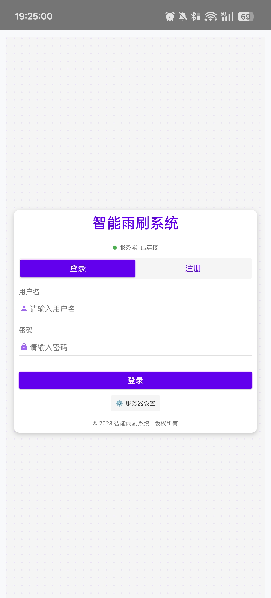
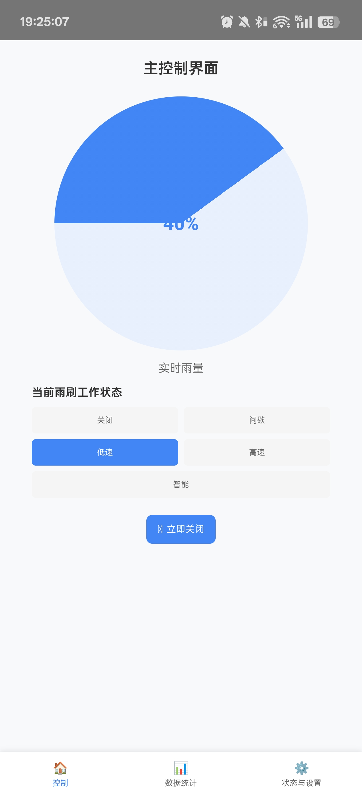
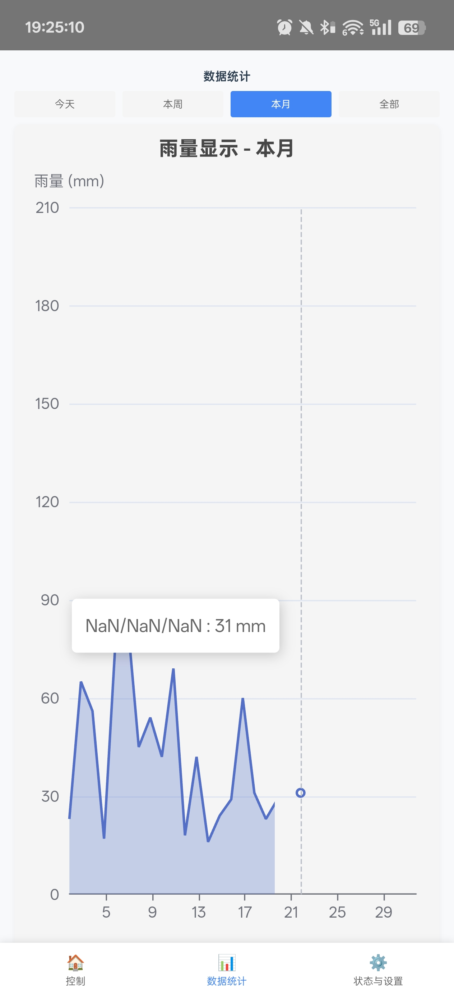
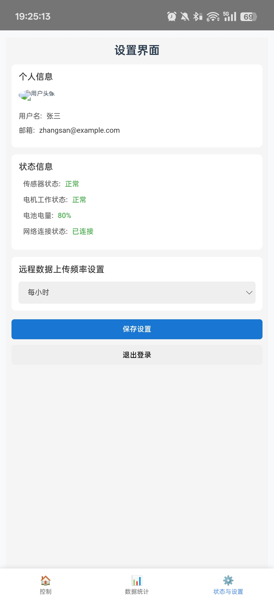

# 智能雨刷控制系统 (Intelligent-Wiper)

## 项目简介

智能雨刷控制系统是一个基于Vue.js和Node.js的全栈应用，结合Python后端进行雨量数据采集和处理。系统可以实时监测雨量数据，并根据雨量大小自动控制雨刷的工作模式。该项目支持Web端和安卓APP两种使用方式，为用户提供了便捷的雨刷控制体验。

## 系统架构

### 技术栈

- **前端**：Vue 3 + Vue Router
- **后端**：Node.js (Express) + Python
- **移动端**：Capacitor (Android)
- **数据可视化**：ECharts
- **数据库**：MySQL

### 系统组成

1. **前端界面**：提供用户登录、雨量控制、数据统计和系统设置功能
2. **Node.js服务器**：处理HTTP请求，连接前端和Python后端
3. **Python数据处理模块**：负责雨量数据采集、聚合和分析
4. **数据库**：存储用户信息和雨量数据

## 功能特点

- 实时雨量数据监测和显示
- 雨量数据统计和图表分析
- 雨刷模式自动/手动控制
- 用户认证和权限管理
- 支持Web端和安卓APP访问
- 模拟数据生成功能，便于测试和演示

## 安装和设置

### 前提条件

- Node.js 14+
- Python 3.8+
- MySQL 5.7+

### 安装步骤

1. **克隆项目**

```bash
git clone <repository-url>
cd Intelligent_wiper
```

2. **安装前端依赖**

```bash
npm install
```

3. **安装Python依赖**

```bash
pip install -r python/requirements.txt
```

4. **配置数据库**

编辑 `python/rainfall_db.py` 文件中的数据库连接信息。

5. **初始化数据库**

```bash
python python/rainfall_db.py --action=init
```

## 开发环境

### 启动开发服务器

```bash
# 启动前端、后端和数据服务
npm run dev

# 或使用热重载模式
npm run dev:watch
```

### 编译和构建

```bash
# 编译前端代码
npm run build

# 代码检查
npm run lint
```

## 安卓APP打包

### 环境准备

1. 安装JDK 11或更高版本
2. 安装Android Studio
3. 通过Android Studio安装Android SDK
4. 设置环境变量：ANDROID_HOME和JAVA_HOME

### 打包步骤

```bash
# 一键构建安卓APP
npm run build:android
```

详细步骤请参考 [android-build.md](./android-build.md)

### 模拟器调试

在网易模拟器的shell文件夹下运行CMD，输入以下命令：
```bash
adb.exe connect 127.0.0.1:16384
```

## Python模块

### 数据管理

系统使用MySQL数据库，设计了以下表结构：

1. `rainfall_raw` - 原始雨量数据（5秒间隔）
2. `rainfall_10min` - 10分钟聚合数据
3. `rainfall_hourly` - 小时聚合数据
4. `rainfall_daily` - 日聚合数据
5. `rainfall_monthly` - 月聚合数据

### 数据采集

```bash
# 使用模拟数据，每5秒采集一次
python python/rainfall_collector.py --action=start --interval=5 --verbose

# 使用真实数据（需要实现硬件接口）
python python/rainfall_collector.py --action=start --interval=5 --real --verbose
```

### 雨量级别定义

- 无降雨：< 0.3 mm/h
- 小雨：0.3 - 2.2 mm/h
- 中雨：2.2 - 4.0 mm/h
- 大雨：4.0 - 33 mm/h

## 应用截图

### 1. 登录界面



### 2. 控制界面



### 3. 数据统计界面



### 4. 设置界面



## 注意事项

1. 数据采集脚本会自动每10分钟执行一次数据聚合
2. 使用 Ctrl+C 可以优雅地停止数据采集脚本
3. 如需使用真实硬件数据，请在 `rainfall_collector.py` 中实现 `collect_real_data()` 函数
4. 前端API地址配置在 `src/services/api.js` 文件中
5. 确保服务器防火墙已开放3000端口

## 常见问题

### 如何管理Python依赖？

```bash
# 导出依赖
pip freeze > requirements.txt

# 使用conda导出依赖
conda list --export > requirements.txt
```

### 如何修改服务器端口？

编辑 `server/config/index.js` 文件中的 `port` 值。

### 如何连接真实硬件？

实现 `python/rainfall_collector.py` 中的 `collect_real_data()` 函数，连接您的硬件设备。

## 自定义配置

更多Vue配置信息，请参考 [Vue CLI配置参考](https://cli.vuejs.org/config/)。