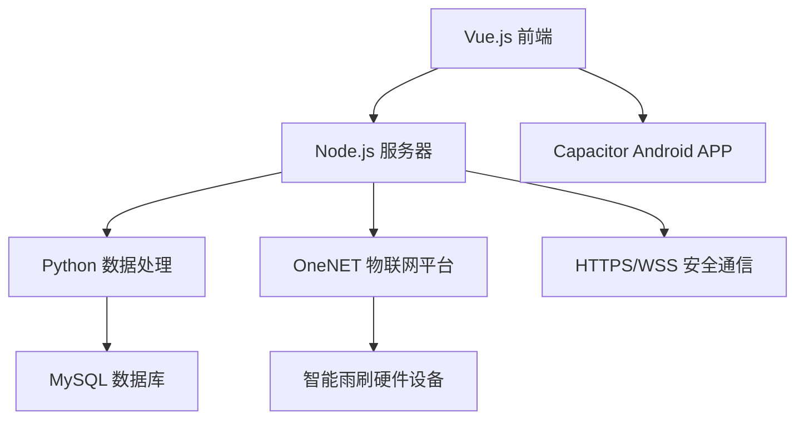

# 智能雨刷控制系统 (Intelligent Wiper Control System)

[](https://vuejs.org/)
[](https://nodejs.org/)
[](https://python.org/)
[](https://capacitorjs.com/)
[](https://mysql.com/)

## 📋 项目简介

智能雨刷控制系统是一个集成了物联网、数据分析和移动应用的全栈解决方案。系统通过实时监测雨量数据，智能控制雨刷工作模式，支持Web端和Android APP双平台访问。项目采用现代化技术栈，提供完整的设备管理、数据可视化和用户认证功能。

## 🏗️ 系统架构

### 核心技术栈

- **前端框架**：Vue 3 + Vue Router + ECharts
- **后端服务**：Node.js (Express) + Python
- **移动端**：Capacitor 7 (Android)
- **数据库**：MySQL 5.7+
- **物联网平台**：OneNET (中国移动)
- **通信协议**：MQTT + HTTP API
- **数据可视化**：ECharts 5.6+

### 系统组件



1. **前端应用**：Vue 3 SPA，提供用户界面和数据可视化
2. **Node.js 服务器**：API网关，处理认证、路由和业务逻辑
3. **Python 数据引擎**：雨量数据采集、处理和分析
4. **MySQL 数据库**：多层级数据存储和聚合
5. **OneNET 平台**：设备管理和MQTT通信
6. **硬件设备**：ESP32智能雨刷控制器

## ✨ 核心功能

### � 智能控制中心 (Home)
- **实时雨量监测**：圆形进度图显示当前雨量百分比
- **雨刷智能控制**：5种工作模式（关闭/间歇/低速/高速/智能）
- **语音控制系统**：支持语音命令控制雨刷开关和模式切换
- **数据源切换**：支持OneNET平台和本地模拟数据
- **实时状态显示**：设备连接状态、数据同步状态
- **自动数据轮询**：每5秒自动更新雨量数据

### 📊 数据统计分析 (Statistics)
- **多时间维度统计**：10分钟/小时/日/月数据聚合
- **ECharts动态图表**：实时更新的折线图和柱状图
- **数据手动聚合**：支持手动触发数据聚合操作
- **历史趋势分析**：最近30天数据对比
- **当前小时统计**：实时累计雨量显示
- **数据单位自适应**：mm/h 和 mm/天单位切换

### 🌤️ 天气预报系统 (Weather)
- **多源天气数据**：和风天气API集成
- **城市搜索定位**：支持城市名称搜索和GPS定位
- **实时天气信息**：温度、湿度、风向、体感温度
- **未来预报**：3天天气预报和24小时逐时预报
- **分钟级降水**：未来2小时分钟级降水预报
- **热门城市快选**：预设热门城市快速切换
- **权限管理**：智能处理定位权限请求

### 🗺️ 地图天气导航 (Map)
- **高德地图集成**：3D地图显示和交互
- **天气图层模式**：点击地图查看任意位置天气
- **路线规划功能**：起点终点设置和路径规划
- **路线天气检查**：沿途多点天气采样和分析
- **POI搜索**：地点搜索和标记功能
- **导航信息显示**：距离、时间、路况信息
- **采样点标记**：路线天气检查点可视化

### ⚙️ 个人设置中心 (Settings)
- **用户信息管理**：用户名显示和个人资料
- **设备激活系统**：激活码输入和设备绑定
- **设备状态显示**：激活状态、设备信息、固件版本
- **系统参数配置**：上传频率、服务器地址设置
- **安全登出功能**：保留登录凭据的安全登出
- **平台适配**：Android平台特殊配置支持

### 🔐 认证和安全
- **JWT令牌认证**：安全的用户会话管理
- **激活码验证**：设备绑定和权限控制
- **记住登录状态**：可选的登录凭据保存
- **路由守卫**：页面访问权限控制
- **会话管理**：自动登录和安全登出

### 🎤 语音控制系统
- **讯飞语音识别**：实时语音转文字
- **智能命令解析**：自然语言命令识别
- **雨刷语音控制**：语音开关和模式切换
- **多种命令支持**：开启/关闭/智能/间歇/低速/高速
- **实时反馈**：语音识别结果和执行状态显示
- **错误处理**：网络异常和识别失败处理

### 🌐 多数据源支持
- **OneNET物联网平台**：中国移动物联网平台集成
- **MQTT实时通信**：设备状态和数据实时同步
- **本地数据模拟**：开发测试用模拟数据生成
- **数据源切换**：动态切换数据来源
- **自动同步机制**：定时数据同步和聚合
- **数据备份恢复**：数据安全和恢复机制

## � API接口和服务

### 🌧️ 雨量数据API (`/api/rainfall`)
- `GET /home` - 获取首页实时雨量数据
- `GET /stats` - 获取统计数据（支持10min/hourly/daily/all时间段）
- `POST /init-mock` - 初始化模拟数据
- `GET /aggregate` - 手动触发数据聚合
- `GET /onenet-sync` - OneNET数据同步

### 🌤️ 天气服务API (`/api/weather`)
- `GET /city` - 城市信息查询
- `GET /now` - 实时天气数据
- `GET /forecast` - 3天天气预报
- `GET /minutely` - 分钟级降水预报
- `GET /hourly` - 24小时逐时预报

### 🗺️ 地图和位置API
- `GET /api/iplocation` - IP地址定位服务
- `GET /api/amap/amap` - 高德天气API代理
- 高德地图JavaScript API集成
- POI搜索和地理编码服务

### 🚗 雨刷控制API (`/api/wiper`)
- `POST /control` - 雨刷模式控制
- `GET /status` - 获取雨刷当前状态
- OneNET平台设备命令下发
- 实时状态反馈机制

### 🔐 认证和设备API
- `POST /api/auth/login` - 用户登录
- `POST /api/auth/logout` - 用户登出
- `POST /api/device/activation/activate` - 设备激活
- `GET /api/device/activation/status` - 激活状态查询

### 📊 系统状态API (`/api/status`)
- 服务器运行状态监控
- 数据库连接状态检查
- Python服务状态监控
- 系统资源使用情况

## 🛠️ 服务架构

### 🎯 前端服务模块
- **authService.js** - 用户认证和会话管理
- **rainfallService.js** - 雨量数据状态管理
- **weatherService.js** - 天气数据获取和缓存
- **mapService.js** - 高德地图服务封装
- **voiceService.js** - 讯飞语音识别集成
- **oneNetService.js** - OneNET平台数据同步
- **routeWeatherService.js** - 路线天气分析服务

### 🔧 后端服务模块
- **rainfallCollector.js** - 雨量数据采集服务
- **databaseService.js** - 数据库操作封装
- **oneNetActivationService.js** - OneNET设备激活
- **pythonRunner.js** - Python脚本执行器
- **networkUtils.js** - 网络工具和IP定位
- **securityUtils.js** - 安全工具和加密

### 🐍 Python数据引擎
- **rainfall_db.py** - 数据库核心操作模块
- **rainfall_api.py** - 数据API接口服务
- **onenet_sync.py** - OneNET平台数据同步
- **device_simulator.py** - 设备数据模拟器
- **mqtt_device_simulator.py** - MQTT设备模拟
- **onenet_stats.py** - OneNET平台统计分析

## �🚀 快速开始

### 📋 环境要求

| 组件 | 版本要求 | 说明 |
|------|----------|------|
| Node.js | 14.0+ | JavaScript运行环境 |
| Python | 3.8+ | 数据处理引擎 |
| MySQL | 5.7+ | 数据库服务 |
| Android Studio | 最新版 | Android开发环境 |
| JDK | 11+ | Java开发工具包 |

### 🔧 安装步骤

#### 1. 克隆项目
```bash
git clone <repository-url>
cd Intelligent_wiper
```

#### 2. 安装Node.js依赖
```bash
# 安装前端和服务器依赖
npm install

# 验证安装
npm list --depth=0
```

#### 3. 配置Python环境
```bash
# 创建虚拟环境（推荐）
python -m venv venv
source venv/bin/activate  # Linux/Mac
# 或
venv\Scripts\activate     # Windows

# 安装Python依赖
pip install -r requirements.txt

# 验证安装
pip list
```

#### 4. 数据库配置
```bash
# 创建数据库
mysql -u root -p
CREATE DATABASE intelligent_wiper CHARACTER SET utf8mb4 COLLATE utf8mb4_unicode_ci;

# 初始化数据表
python python/rainfall_db.py --action=init

# 生成测试数据（可选）
python python/rainfall_db.py --action=mock --days=7
```

#### 5. 环境配置
```bash
# 复制配置文件模板
cp server/config/index.js.example server/config/index.js
cp device_config.json.example device_config.json

# 编辑配置文件，填入实际参数
# - 数据库连接信息
# - OneNET平台配置
# - 设备认证信息
```

#### 6. SSL证书生成（HTTPS支持）
```bash
# 自动生成开发证书
npm run generate:cert

# 或手动生成
node server/generate-cert.js
```

## 💻 开发环境

### 🚀 启动服务

#### 一键启动（推荐）
```bash
# 同时启动前端、后端和数据服务
npm run dev
```

#### 分别启动服务
```bash
# 启动前端开发服务器 (端口: 8080)
npm run serve

# 启动Node.js后端服务器 (端口: 3000)
npm run start:server

# 启动Python数据服务
npm run start:db
```

#### 高级开发模式
```bash
# 热重载模式 - 自动重新构建
npm run dev:watch

# 自动构建模式 - 监听文件变化
npm run dev:auto
```

### 🔨 构建和部署

```bash
# 构建生产版本
npm run build

# 代码质量检查
npm run lint

# 清理构建文件
npm run cleanup

# 深度清理（包括node_modules）
npm run cleanup:deep
```

### 📱 移动端开发

```bash
# 初始化Capacitor
npm run cap:init

# 添加Android平台
npm run cap:add:android

# 同步代码到移动端
npm run cap:sync

# 打开Android Studio
npm run cap:open:android

# 一键构建Android APP
npm run build:android
```

## 📱 Android APP 打包

### 🔧 环境准备

#### 必需软件
1. **JDK 11+** - Java开发工具包
2. **Android Studio** - Android开发IDE
3. **Android SDK** - Android软件开发工具包
4. **Gradle** - 构建工具（Android Studio自带）

#### 环境变量配置
```bash
# Windows
set ANDROID_HOME=C:\Users\%USERNAME%\AppData\Local\Android\Sdk
set JAVA_HOME=C:\Program Files\Java\jdk-11.0.x

# Linux/Mac
export ANDROID_HOME=$HOME/Android/Sdk
export JAVA_HOME=/usr/lib/jvm/java-11-openjdk
```

### 📦 构建流程

#### 快速构建
```bash
# 一键构建Android APP
npm run build:android
```

#### 详细步骤
```bash
# 1. 构建Web应用
npm run build

# 2. 同步到Capacitor
npm run cap:sync

# 3. 打开Android Studio进行最终构建
npm run cap:open:android
```

### 🔍 调试和测试

#### 模拟器调试
```bash
# 启动Android模拟器
emulator -avd <AVD_NAME>

# 连接ADB（如使用第三方模拟器）
adb connect 127.0.0.1:16384

# 安装调试版本
adb install android/app/build/outputs/apk/debug/app-debug.apk
```

#### 真机调试
```bash
# 启用开发者选项和USB调试
# 连接设备后检查
adb devices

# 实时日志查看
adb logcat | grep -i capacitor
```

### 📋 签名和发布

#### 生成签名密钥
```bash
keytool -genkey -v -keystore release-key.keystore -alias release -keyalg RSA -keysize 2048 -validity 10000
```

#### 配置签名（android/app/build.gradle）
```gradle
android {
    signingConfigs {
        release {
            storeFile file('../../release-key.keystore')
            storePassword 'your-store-password'
            keyAlias 'release'
            keyPassword 'your-key-password'
        }
    }
    buildTypes {
        release {
            signingConfig signingConfigs.release
            minifyEnabled true
            proguardFiles getDefaultProguardFile('proguard-android.txt'), 'proguard-rules.pro'
        }
    }
}
```
## 🐍 Python 数据引擎

### 📊 数据库架构

系统采用多层级数据存储架构，支持不同时间粒度的数据聚合：

| 数据表 | 时间间隔 | 数据保留期 | 用途 |
|--------|----------|------------|------|
| `rainfall_raw` | 5秒 | 7天 | 实时数据采集 |
| `rainfall_10min` | 10分钟 | 30天 | 短期趋势分析 |
| `rainfall_hourly` | 1小时 | 1年 | 中期统计分析 |
| `rainfall_daily` | 1天 | 5年 | 长期趋势分析 |
| `rainfall_monthly` | 1月 | 永久 | 历史数据归档 |

### 🔧 核心模块

#### 数据库服务 (`db_service.py`)
```bash
# 启动数据库服务
python python/db_service.py

# 初始化数据库表结构
python python/rainfall_db.py --action=init

# 生成测试数据
python python/rainfall_db.py --action=mock --days=7
```

#### OneNET 物联网平台集成
```bash
# 设备状态检查
python python/check_devices.py

# 设备激活管理
python python/mqtt_device_activator.py

# 实时数据同步
python python/onenet_sync.py

# 设备统计信息
python python/onenet_stats.py
```

#### 数据采集和处理
```bash
# 启动实时数据采集（模拟模式）
python python/device_simulator.py --interval=5 --verbose

# 启动真实设备数据采集
python python/mqtt_device_simulator.py --real --interval=5

# 数据API服务
python python/rainfall_api.py --action=stats --period=hourly
```

### 🌧️ 雨量分级标准

| 级别 | 雨量范围 (mm/h) | 雨刷模式 | 描述 |
|------|-----------------|----------|------|
| 无雨 | < 0.3 | 关闭 | 晴朗天气 |
| 小雨 | 0.3 - 2.2 | 间歇 | 轻微降雨 |
| 中雨 | 2.2 - 4.0 | 低速 | 适中降雨 |
| 大雨 | 4.0 - 33.0 | 高速 | 强烈降雨 |
| 暴雨 | > 33.0 | 智能 | 极端天气 |

### 📡 OneNET 平台配置

#### 设备注册
```bash
# 查看设备列表
python python/list_devices.py

# 设备状态诊断
python python/device_status_diagnosis.py

# 重新激活设备
python python/reactivate_device.py --device-id=<DEVICE_ID>
```

#### MQTT 通信
```bash
# 启动MQTT设备模拟器
python python/mqtt_device_simulator.py

# HTTP API 控制
python python/onenet_http_control.py --command=wiper_on
```

## 🔐 设备激活码管理

### 📋 激活码生成

系统提供完整的激活码批量生成解决方案，支持多种格式和自定义配置。

#### 快速生成
```bash
# 快速生成10个标准激活码（推荐）
node quick_generate.js

# 查看激活码使用统计
node generate_activation_codes.js --stats
```

#### 自定义生成
```bash
# 生成20个激活码
node generate_activation_codes.js -c 20

# 生成指定前缀的激活码
node generate_activation_codes.js -c 50 -p TEST

# 生成16位随机格式激活码
node generate_activation_codes.js -f random -c 10

# 生成UUID格式激活码
node generate_activation_codes.js -f uuid -c 5
```

### 🎯 激活码格式

| 格式类型 | 示例 | 特点 | 适用场景 |
|----------|------|------|----------|
| Standard | `WIPE-2535-2E3E-B1D2` | 16位标准格式 | 生产环境（推荐） |
| Simple | `WIPER-2025-0001` | 简单递增格式 | 测试环境 |
| Random | `6517-A56B-AF1C-1F7D` | 16位纯随机 | 高安全要求 |
| UUID | `8348-8A96-2B0E-4903` | 基于UUID | 大规模部署 |
| Mixed | `WI25-33D9-A71B-F4AB` | 混合格式 | 平衡安全性 |

### 📊 设备管理

#### 设备配置
设备配置文件 `device_config.json` 包含：
- **设备信息**：设备ID、产品ID、设备密钥
- **OneNET配置**：平台URL、MQTT服务器、认证方式
- **硬件配置**：GPIO引脚、传感器参数、雨刷模式
- **通信设置**：超时时间、重试次数、缓冲区大小

#### 设备能力
- **雨刷模式**：关闭/间歇/低速/高速/智能
- **传感器**：雨量传感器、电池监控、信号强度
- **安全特性**：命令验证、用户认证、日志记录

## 📸 应用截图

### 🔐 用户认证

*用户登录界面 - 支持激活码认证和记住登录状态*

### 🎛️ 控制中心

*雨刷控制界面 - 实时状态显示和模式切换*

### 📊 数据分析

*数据统计界面 - ECharts动态图表和多维度分析*

### ⚙️ 系统设置

*设置界面 - 个性化配置和系统参数调整*

## ⚠️ 重要注意事项

### 🔧 系统配置
1. **数据聚合**：系统自动每10分钟执行一次数据聚合，确保数据一致性
2. **端口配置**：默认端口 Web(8080)、API(3000)，确保防火墙已开放
3. **SSL证书**：生产环境建议使用正式SSL证书，开发环境可使用自签名证书
4. **数据库连接**：确保MySQL服务正常运行，连接池配置合理

### 🌐 网络和安全
1. **HTTPS支持**：Capacitor要求HTTPS环境，确保SSL配置正确
2. **CORS配置**：跨域请求已配置，如有问题检查 `server/middleware/cors.js`
3. **OneNET平台**：确保设备ID和密钥配置正确，网络连接稳定
4. **API认证**：所有API请求需要JWT令牌，注意令牌过期处理

### 📱 移动端特殊要求
1. **Android权限**：确保应用具有网络访问权限
2. **Capacitor配置**：`capacitor.config.ts` 中的服务器配置需与实际环境匹配
3. **调试模式**：开发时可使用 `adb logcat` 查看详细日志

## 🔧 故障排除

### 常见问题解决

#### 🐍 Python环境问题
```bash
# 依赖管理
pip freeze > requirements.txt  # 导出依赖
pip install -r requirements.txt  # 安装依赖

# 虚拟环境问题
python -m venv venv --clear  # 重建虚拟环境
source venv/bin/activate  # 激活环境

# 数据库连接问题
python python/rainfall_db.py --action=test  # 测试数据库连接
```

#### 🌐 Node.js服务问题
```bash
# 端口占用
netstat -ano | findstr :3000  # Windows
lsof -i :3000  # Linux/Mac

# 依赖问题
npm cache clean --force  # 清理缓存
rm -rf node_modules package-lock.json  # 重新安装
npm install

# SSL证书问题
node server/generate-cert.js  # 重新生成证书
```

#### 📱 Android构建问题
```bash
# Gradle问题
cd android && ./gradlew clean  # 清理构建
./gradlew build --debug  # 调试构建

# SDK问题
echo $ANDROID_HOME  # 检查环境变量
sdkmanager --list  # 查看SDK状态
```

#### 🔐 激活码问题
```bash
# 检查激活码状态
node generate_activation_codes.js --stats

# 重新生成激活码
node quick_generate.js

# 验证JSON格式
node -e "console.log(JSON.parse(require('fs').readFileSync('server/data/device_activations.json')))"
```

### 📊 性能优化

#### 数据库优化
```sql
-- 添加索引优化查询
CREATE INDEX idx_rainfall_timestamp ON rainfall_raw(timestamp);
CREATE INDEX idx_rainfall_hourly_date ON rainfall_hourly(date_hour);

-- 定期清理过期数据
DELETE FROM rainfall_raw WHERE timestamp < DATE_SUB(NOW(), INTERVAL 7 DAY);
```

#### 前端优化
```bash
# 构建优化
npm run build -- --mode production

# 代码分析
npm install -g webpack-bundle-analyzer
npx webpack-bundle-analyzer dist/static/js/*.js
```

## 🛠️ 项目维护

### 🧹 清理和重置
```bash
# 清理Python缓存
find . -name "__pycache__" -type d -exec rm -rf {} +
find . -name "*.pyc" -delete

# 清理Node.js缓存
npm cache clean --force
rm -rf node_modules package-lock.json

# 清理构建文件
rm -rf dist/
rm -rf android/app/build/

# 完整重建
npm install && npm run build
```

### 📦 版本管理
```bash
# 查看当前版本
npm version

# 更新版本
npm version patch  # 补丁版本
npm version minor  # 次要版本
npm version major  # 主要版本
```

### 🔄 数据备份
```bash
# 数据库备份
mysqldump -u root -p intelligent_wiper > backup_$(date +%Y%m%d).sql

# 激活码备份
cp server/data/device_activations.json backup/device_activations_$(date +%Y%m%d).json

# 配置文件备份
tar -czf config_backup_$(date +%Y%m%d).tar.gz server/config/ device_config.json
```

## 📚 技术文档

### 🔗 相关链接
- [Vue.js 官方文档](https://vuejs.org/guide/)
- [Capacitor 官方文档](https://capacitorjs.com/docs)
- [OneNET 平台文档](https://open.iot.10086.cn/doc/)
- [ECharts 图表库](https://echarts.apache.org/zh/index.html)
- [Express.js 框架](https://expressjs.com/)

### 📖 扩展阅读
- [MQTT协议详解](https://mqtt.org/)
- [JWT认证机制](https://jwt.io/introduction)
- [MySQL性能优化](https://dev.mysql.com/doc/refman/8.0/en/optimization.html)
- [Android应用开发](https://developer.android.com/guide)

## 📄 许可证

本项目采用 MIT 许可证 - 查看 [LICENSE](LICENSE) 文件了解详情。

## 🤝 贡献指南

欢迎提交 Issue 和 Pull Request 来改进项目！

### 开发规范
1. 遵循现有代码风格
2. 添加适当的注释和文档
3. 确保所有测试通过
4. 提交前运行 `npm run lint`

## 📋 项目特色总结

### 🎯 技术亮点
1. **全栈物联网解决方案**：从硬件设备到移动应用的完整生态
2. **多平台数据融合**：OneNET物联网 + 和风天气 + 高德地图
3. **智能语音交互**：讯飞语音识别 + 自然语言处理
4. **实时数据处理**：5秒级数据采集 + 多层级聚合存储
5. **跨平台部署**：Web + Android + PWA三端适配

### 🚀 创新功能
1. **路线天气分析**：出行前检查沿途天气状况
2. **语音雨刷控制**：解放双手的智能语音操作
3. **多数据源切换**：灵活的数据来源管理
4. **设备激活系统**：企业级设备管理和权限控制
5. **地图天气融合**：地理位置与天气数据的深度结合

### 💡 应用场景
- **个人用户**：智能汽车雨刷自动控制
- **车队管理**：多车辆雨刷状态统一监控
- **出行规划**：基于天气的路线规划建议
- **设备厂商**：雨刷设备的物联网化改造
- **数据分析**：降雨模式和设备使用分析

### 🔮 扩展潜力
- 支持更多车载设备控制（空调、车窗等）
- 集成更多天气数据源和预警系统
- 添加机器学习的智能预测功能
- 支持车联网V2X通信协议
- 开发智能驾驶辅助功能

---

**智能雨刷控制系统** - 让科技为生活服务 🌧️🚗✨

*一个展现现代物联网应用开发最佳实践的完整项目案例*