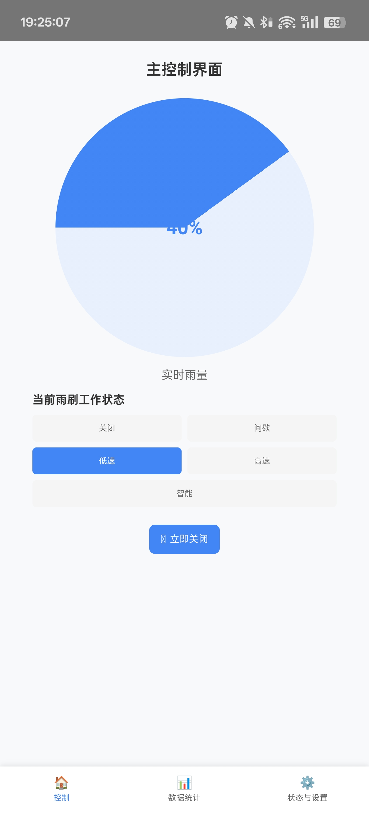
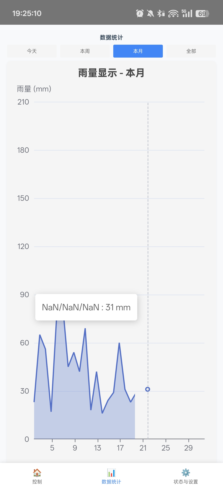
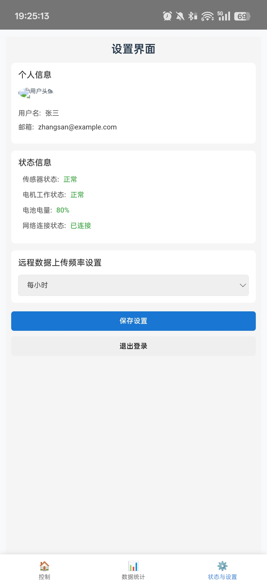

# wx_to_vue

## Project setup
```
npm install
```

### Compiles and hot-reloads for development
```
npm run serve
```

### Compiles and minifies for production
```
npm run build
```

### Lints and fixes files
```
npm run lint
```

### Customize configuration
See [Configuration Reference](https://cli.vuejs.org/config/).

### 模拟器调试
 在网易模拟器的shell文件夹下运行CMD，输入以下命令
 adb.exe connect 127.0.0.1:16384

### python依赖
使用conda list --export > requirements.txt导入依赖
pip freeze > requirements.txt 导出依赖

### 安卓端效果图






